# Data preparation using Amazon Redshift with AWS Glue DataBrew

This lab is provided as part of **[AWS Innovate Data Edition](https://aws.amazon.com/events/aws-innovate/data/)**,  it has been adapted from an [AWS Blog](https://aws.amazon.com/blogs/big-data/data-preparation-using-amazon-redshift-with-aws-glue-databrew/)

Click [here](https://github.com/phonghuule/aws-innovate-data-edition-2022) to explore the full list of hands-on labs.

ℹ️ You will run this lab in your own AWS account and running this lab will incur some costs. Please follow directions at the end of the lab to remove resources to avoid future costs.

## Table of Contents  
* [Overview](#overview)  
* [Architecture](#architecture)  
* [Step 1 - Create Redshift Cluster](#step-1---create-redshift-cluster)  
* [Step 2 - Setup Student dataset](#step-2---setup-student-dataset)  
* [Step 3 - Create VPC Endpoints](#step-3---create-vpc-endpoints)
* [Step 4 - Alter Security Group Rules](#step-4---alter-security-group-rules)
* [Step 5 - Create an S3 Bucket](#step-5---create-an-s3-bucket)
* [Step 6 - Prepare data using DataBrew](#step-6---prepare-data-using-databrew)
* [Summary](#summary)
* [Cleanup](#cleanup)
* [Survey](#survey)

## Overview

In this lab we will use AWS Glue DataBrew to prepare data from Amazon Redshift. We will explore a student dataset stored in Amazon Redshift containing details of school id, name, age, country, gender, number of study hours and marks. We will use AWS Glue DataBrew to connect to Redshift cluster and ingest data. This data will then be prepared, cleaned and made ready for a downstream machine learning process.  

With AWS Glue DataBrew, users can evaluate the quality of your data by profiling it to understand data patterns and detect anomalies. They can also visualize, clean, and normalize data directly from your data lake, data warehouses, and database including Amazon S3, Amazon Redshift, Amazon Aurora, and Amazon RDS.

Now, with added support for JDBC-accessible databases, DataBrew also supports additional data stores, including PostgreSQL, MySQL, Oracle, and Microsoft SQL Server. In this post, we use DataBrew to clean data from an Amazon Redshift table, and transform and use different feature engineering techniques to prepare data to build a machine learning (ML) model. Finally, we store the transformed data in an S3 data lake to build the ML model in Amazon SageMaker.

## Architecture
In this lab we will setup the following architecture. The architecture will have several components explained below.

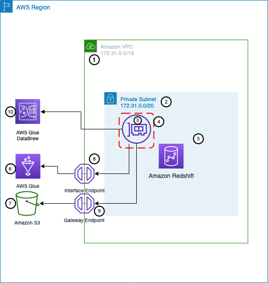

#### Components
1. VPC - The Amazon Virtual Private Cloud (VPC) will host the Private subnet where the Amazon Redshift cluster will be hosted. In this lab, we will use the default VPC.
2. Private Subnet - The Private subnet will host Elastic Network interface for the Redshift cluster. In this lab we will use the default Subnet. Note: The default is attached to the internet gateway and thus is not private for the lab purposes.
3. Elastic Network Interface (ENI).
4. Security Group - The Security group will specify the inbound and outbound rule to secure the network traffic coming in and going out of the ENI. In this lab we will alter the existing security group.
5. Amazon Redshift - Amazon Redshift will host the student dataset for this lab
6. AWS Glue - The AWS Glue DataBrew created connection to Amazon Redshift will be housed in the AWS Glue service
7. Amazon S3 - The Amazon S3 will store any Glue DataBrew intermediate logs and outputs from the DataBrew recipes.
8. Glue Interface Endpoint - An interface endpoint will make AWS Glue service available within the VPC.
9. S3 Gateway Endpoint - A gateway endpoint will make Amazon S3 service available within the VPC.
10. AWS Glue DataBrew - This service will connect to the student dataset in Amazon Redshift. The Service will allow users to prepare the data and create a reusable recipe to refine the data to make it available to AI/ML services like AWS Sagemaker.

## Step 1 - Create RedShift Cluster
1. Navigate to the [Amazon Redshift](https://ap-southeast-2.console.aws.amazon.com/redshiftv2/home?region=ap-southeast-2#dashboard) service in the AWS Console.
2. Click on create cluster and name the cluster ``student-cluster``.
3. You could choose the **Free Trial** option which will create a cluster will sample data. For this lab we will choose **Production**. 
        
    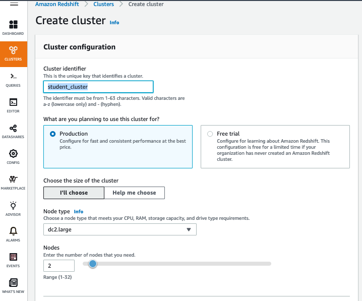

4. Select the instance type as dc2.large and 2 nodes.
5. Leave the checkbox for **Load Sample data** unchecked
6. Use defaults for VPC and Security group. **Note the security group.** We will alter the inbound and outbound rules for this security group at a later step.
    
    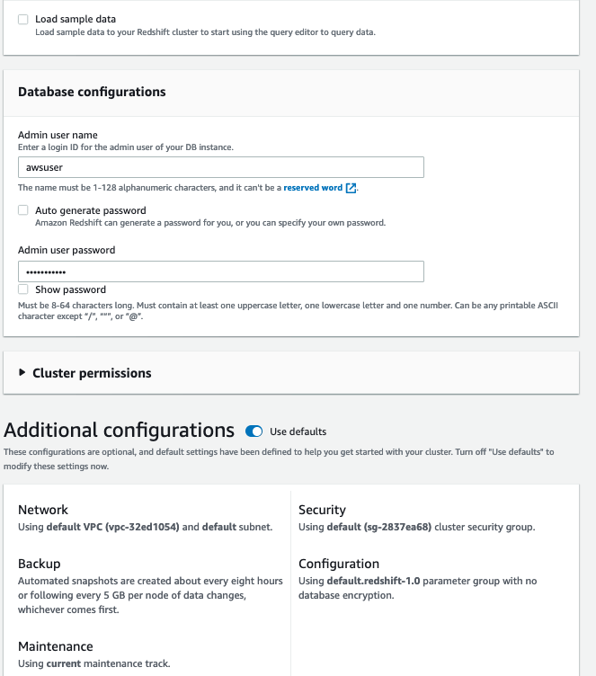

7. Select Create Cluster.

## Step 2 - Setup Student Dataset
1. In the Redshift Console open the **Query Editor** from the side panel

    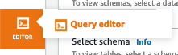

You could also use your preferred SQL client to execute the SQL statements. See here for connecting using [SQLWorkBench/J](https://docs.aws.amazon.com/redshift/latest/mgmt/connecting-using-workbench.html)

2. Connect to the 'dev' db which is created during the creation of the Cluster.

    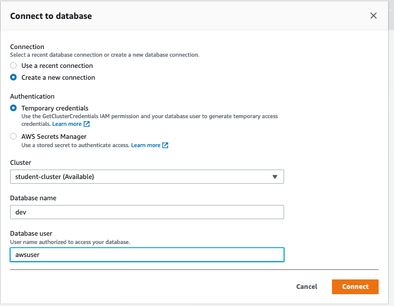

3. In the query editor run the [DDLSchemaTable.sql](./scripts/SQL/DDLSchemaTable.sql)
4. This will create ```student_schema``` schema and a table ```study_details``` within the schema.
5. Following this run the [studentRecordsInsert.sql](./scripts/SQL/studentRecordsInsert.sql) to insert the sample student dataset for the lab.
    
    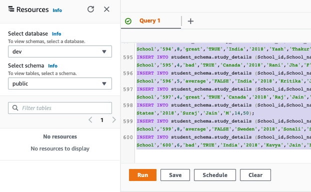

6. View the data student data loaded in Redshift
    
    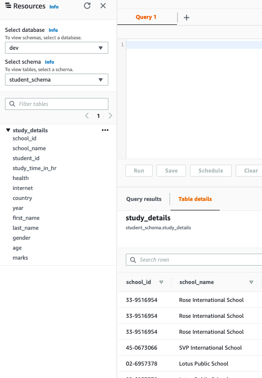        

## Step 3 - Create VPC Endpoints
#### S3 Gateway Endpoint
1. Navigate to the [VPC service](https://ap-southeast-2.console.aws.amazon.com/vpc/home?region=ap-southeast-2) in the AWS Console.
2. Select the Endpoints option from the left pane.
3. Create a VPC Endpoint by selecting the 'Create Endpoint'.
4. Set the servict category as AWS services and search for the S3 service.
5. Select the service with type Gateway.

    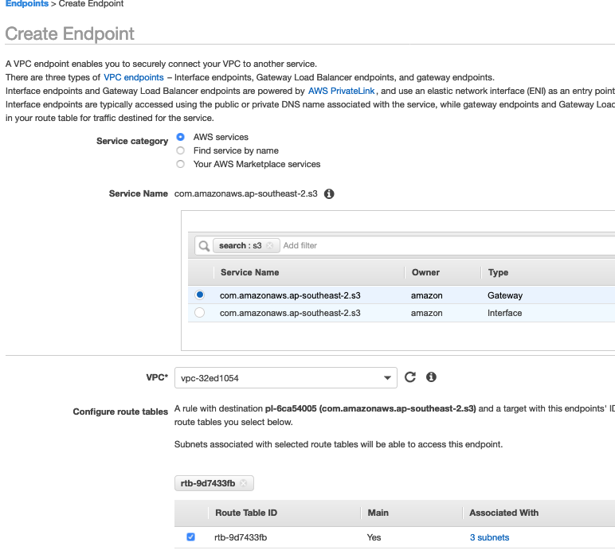

6. The default VPC should be selected by default else select the VPC where the redshift cluster was created.
7. Leave other options as is, scroll down, and click on 'Create Endpoint'
               
    

8. Go to the endpoint and make sure the Route Table is associated with all the subnets

    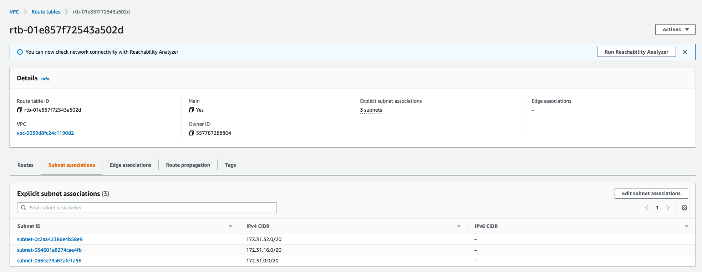

#### Glue Interface Endpoint
1. Create a VPC Endpoint by selecting the 'Create Endpoint'.
2. Set the service category as AWS services and search for the Glue service.
3. Select the service with type Interface.

    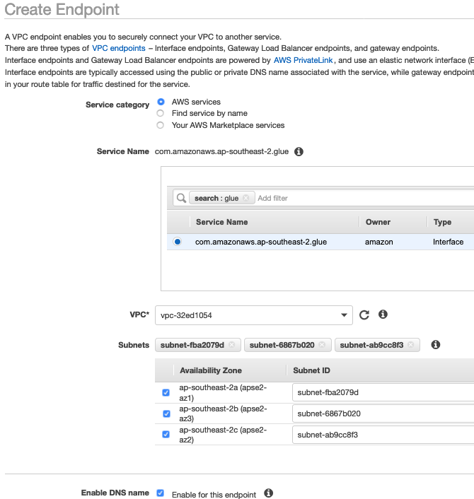

4. The default VPC should be selected by default else select the VPC where the redshift cluster was created.
5. Leave other options as is, scroll down, and click on 'Create Endpoint'
    
    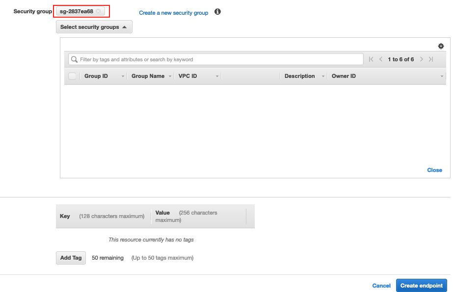

## Step 4 - Alter Security Group Rules
1. Go to the [Security group](https://ap-southeast-2.console.aws.amazon.com/ec2/v2/home?region=ap-southeast-2#SecurityGroups:) feature in the EC2 Console.
2. Fetch the security group noted in [Step1](#step-1---create-redshift-cluster)
3. Alter the inbound rules like so.

    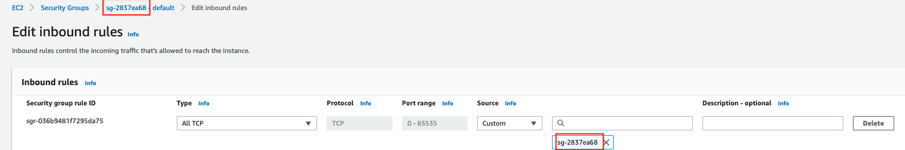

4. Alter the outbound rules like so. While altering the outbound rules, ensure that the prefix list selected (pl-xxxxx) match the prefix list created for the S3 VPC endpoint.
    
    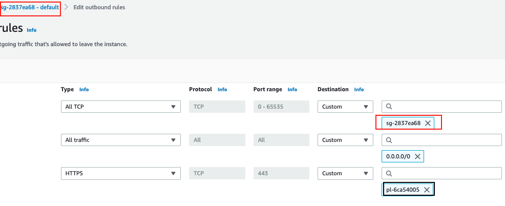

## Step 5 - Create an S3 bucket
1. Go to the [S3 Console](https://s3.console.aws.amazon.com/s3/home?region=ap-southeast-2) and click on create bucket.
2. S3 buckets have to unique. Select a unique name and create bucket.
3. Create 2 folders namely, ```AWSDatasetOutput``` and ```recipeJobOutput```.
    
    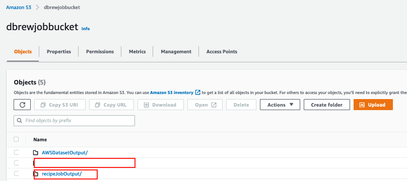

## Step 6 - Create an IAM Role
#### Create new IAM Policy
1. Go to the [IAM Policy console](https://console.aws.amazon.com/iamv2/home?#/policies).
2. Click on Create Policy.
3. Navigate to JSON sub tab and paste the contents of the [policy json](./scripts/json/AwsGlueDataBrewDataResourcePolicy-open.json)
    * This policy is an extension of [AwsGlueDataBrewDataResourcePolicy](https://docs.aws.amazon.com/databrew/latest/dg/iam-policy-for-data-resources-role.html)
    * Additionally to the permissions [AwsGlueDataBrewDataResourcePolicy](https://docs.aws.amazon.com/databrew/latest/dg/iam-policy-for-data-resources-role.html), this databrew instance also requires a few extra permissions. e.g. glue:GetConnection.
    * Note: This policy can be further restricted to allow access to specific resources. An example of a more restricted policy is [AwsGlueDataBrewDataResourcePolicy.json](./scripts/json/AwsGlueDataBrewDataResourcePolicy.json). In this example, the resources section is more specific to allow access to the specific S3 bucket and the specific glue connection.
4. Click Next Tags, then enter ```AwsGlueDataBrewDataResourcePolicy``` as the name of the Policy and click on Create Policy.
#### Create new IAM Role
1. Go to the [IAM Role console](https://console.aws.amazon.com/iamv2/home#/roles).
2. Click on Create Role. 
3. Select **DataBrew** as the trusted entity. Click on Next: Permissions
4. Filter for AwsGlueDataBrewDataResourcePolicy and select policy. 
5. Click on Next:Tags. Add any tags as appropriate. 
6. Click on Next: Review 
7. Record ```AwsGlueDataBrewDataAccessRole``` as the role name and click on Create Role.

## Step 6 - Prepare data using DataBrew
#### Create new connection
1. Go to the [AWS Glue DataBrew](https://ap-southeast-2.console.aws.amazon.com/databrew/home?region=ap-southeast-2#landing).
2. On the left pane select Datasets and navigate to the Connections tab.
    
    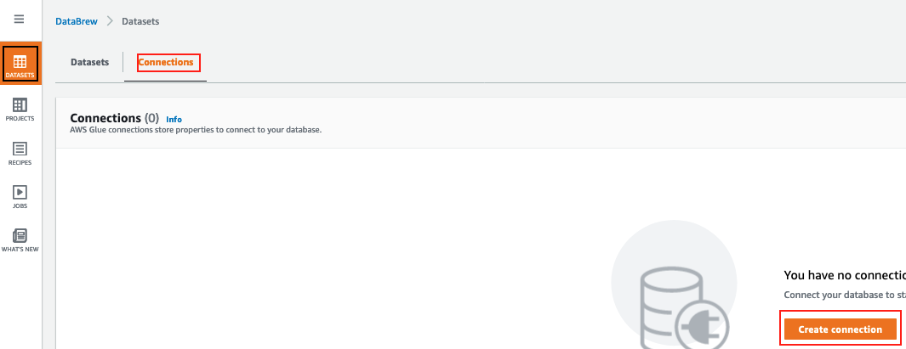

3. Create a new Connection.
4. Enter the Connection name as ```students-connection```.
5. Select 'Amazon RedShift' as the Connection type.
6. Select the Redshift cluster, the database name, the AWS User and the password that was used to create the cluster. 
    
    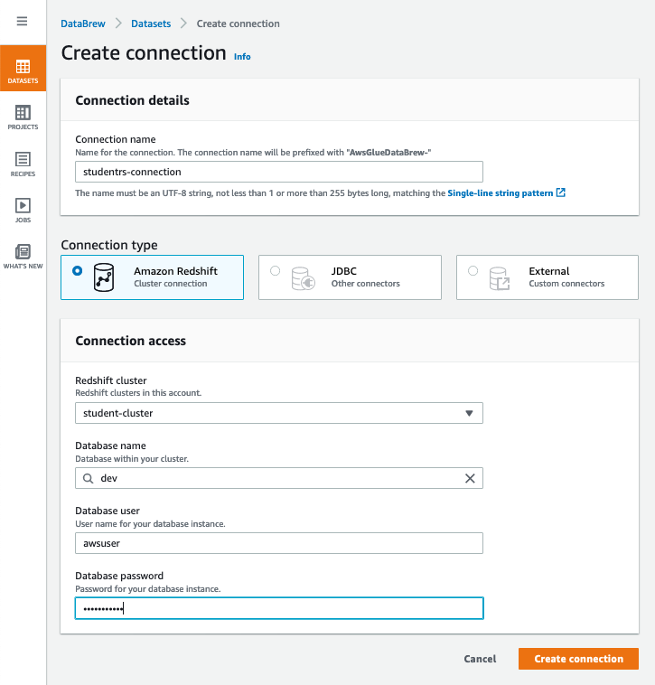

#### Create new dataset
1. Select the created connection and click on 'Create dataset with this connection'.
2. Enter the Dataset name as ```studentrs-dataset```.
3. The connection name should be auto-populated. Select the table, ```study_details```.
4. Enter the s3 destination as ```s3://bucketname/AWSDatasetOutput/```
5. Click on Create dataset.
    
    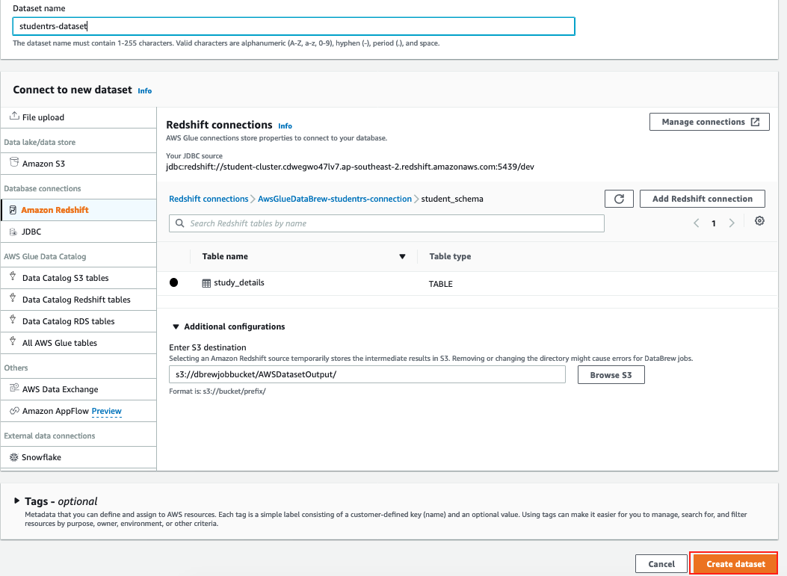

6. At this point, if you open the dataset and navigate to the Data profile overview subtab or Column statistics subtab, you will see no information. This is because a data profiling has not been completed. We will do this in a future step.
    
    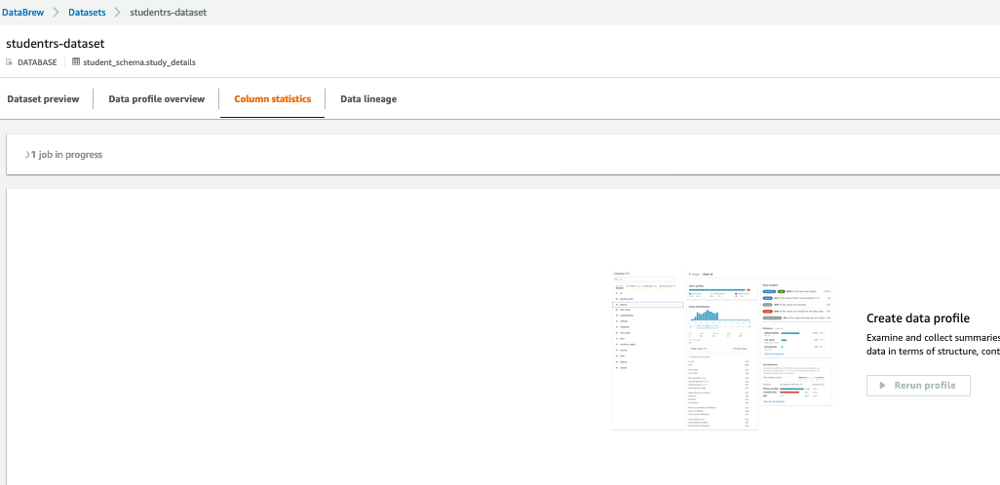

#### Create new project
1. Select the created dataset and click on 'Create project with this dataset'.
    
    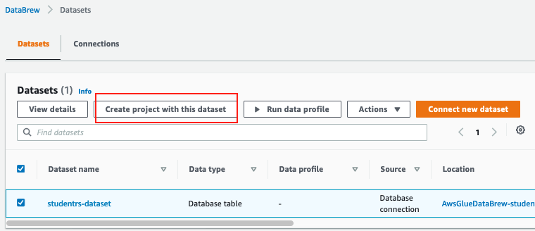

2. Enter the project name as ```studentrs-project```. The recipe name, the dataset name and the table name should be autopopulated.
    
    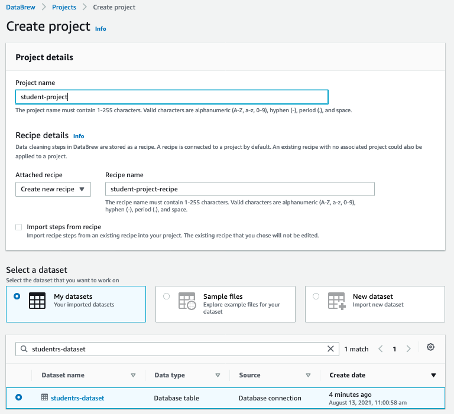

3. Select the Role Name as ```AwsGlueDataBrewDataAccessRole``` created in [Step 6](#step-6---create-an-iam-role)
4. Click on Create Project. Once created, the project will run and provide a sample dataset view.

#### Data profiling 
1. Navigate to the Jobs in the left pane and go to the Profile job
    
    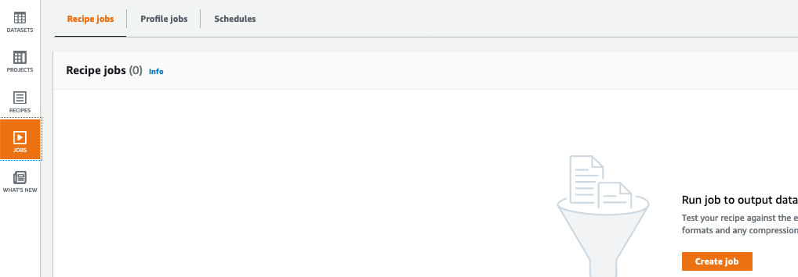

2. Click on 'Create Job' and enter the job name as ```student-profile-job```.
3. Select the 'Create a profile job' option for Job Type.
4. Enter ```studentrs-dataset``` as Job input.
    
    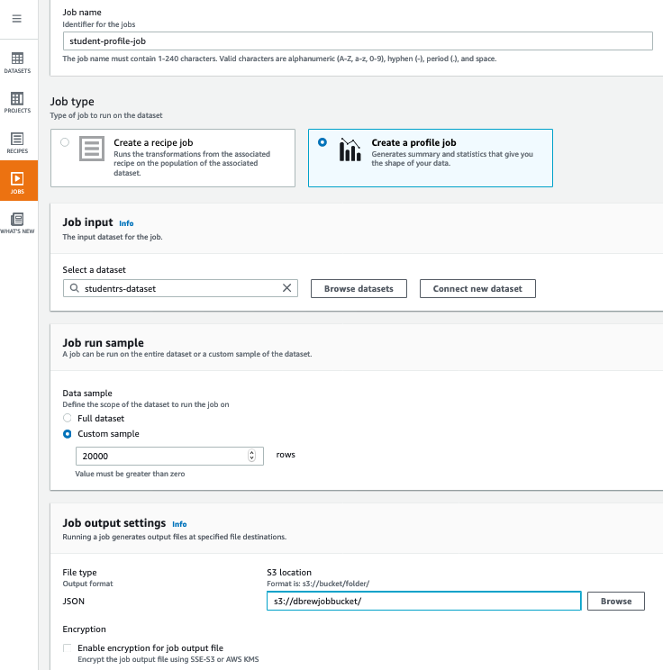

5. For the job output setting enter the s3 location created in [Step 5](#step-5---create-an-s3-bucket). Set as ```s3://bucketname```/.
    
    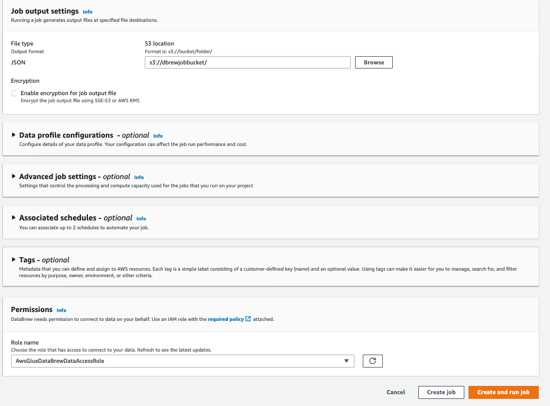

6. Click on 'Create and run job'.
7. Select the created job and monitor progress to make sure the job has completed. This might take a few minutes depending on the size of the dataset.
    
    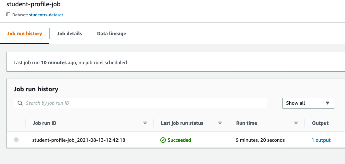

8. Navigate to the Data lineage sub tab for the selected dataset to view a graphical representation of the data flow.

    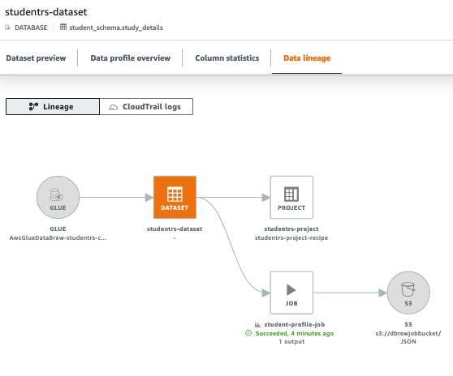

9. Navigate to the dataset and view column statistics. The data profiling job populates this data.
    
    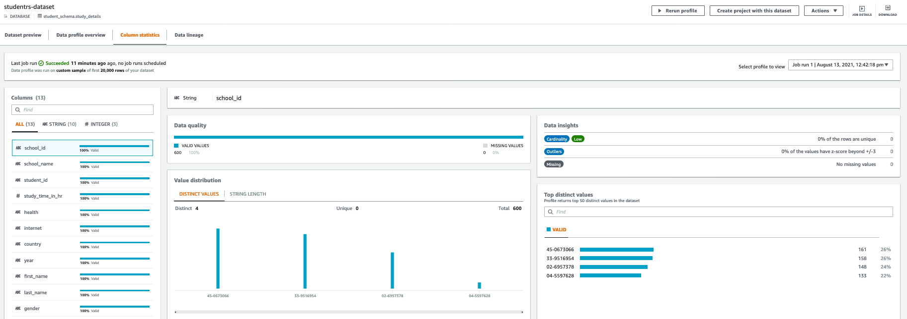

10. The data profiling provides insight into the data. e.g. missing data, outliers etc. In the dataset here we have 3 records without age field populated.
    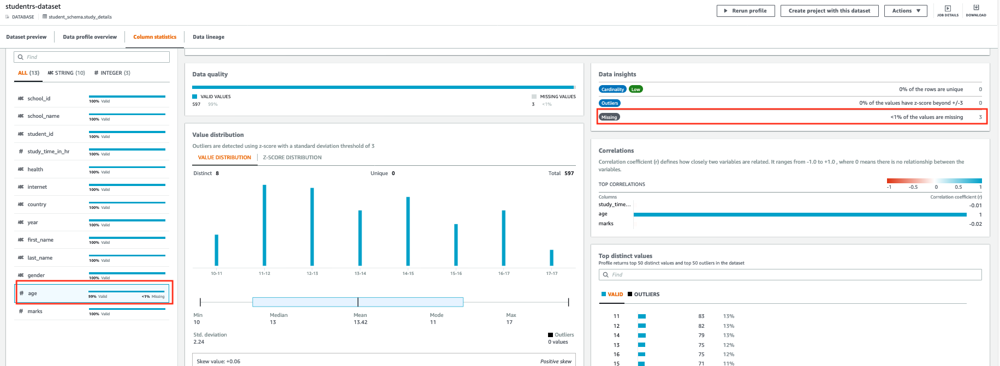

#### Data refining
1. DataBrew allows the refining of data by providing a number of tools that we will explore below. Using these tools, we can create databrew recipes to refine and prepare the data to be ingested by AWS Sagemaker to drive inferences.
2. As part of the refining process, lets delete the first name, last name and the schoolname.
   
    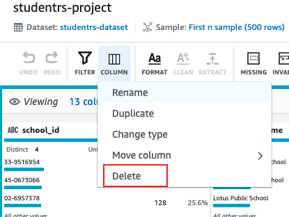
    
    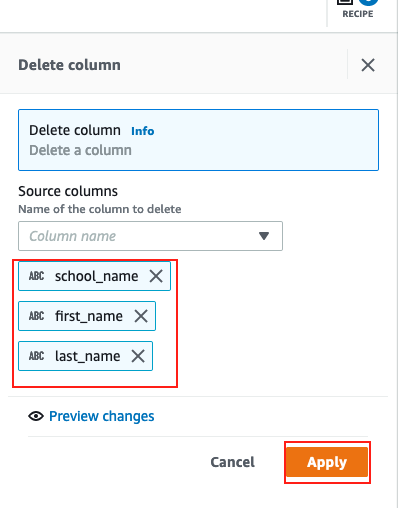

3. We know from the profiling report that the age value is missing in three records. Let’s fill in the missing value with the median age of other records. Choose Missing and choose Fill with numeric aggregate. 
    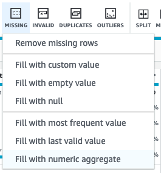
    
    
    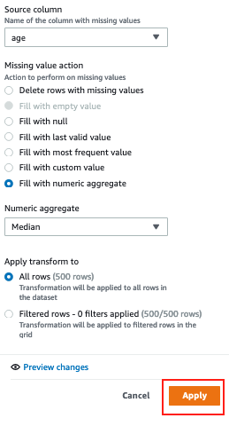

4. The next step is to convert the categorical value to a numerical value for the gender column.
    * Choose Mapping and choose Categorical mapping.
        
    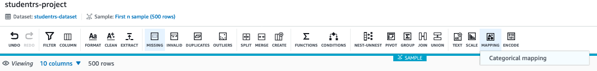
    
    * For Source column, choose gender.
    * For Mapping options, select Map top 2 values.
    * For Map values, select Map values to numeric values.
    * For F, choose 1.
    * For M, choose 2.
    
    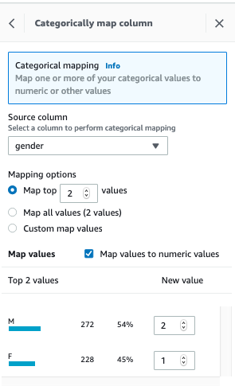

5. ML algorithms often can’t work on label data directly, requiring the input variables to be numeric. One-hot encoding is one technique that converts categorical data that doesn’t have an ordinal relationship with each other to numeric data. To apply one-hot encoding, complete the following steps:
* Choose Encode and choose One-hot encode column.   
    
    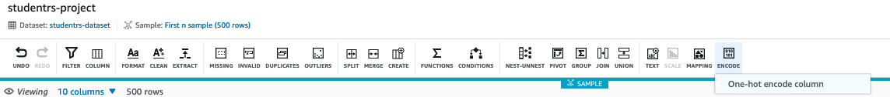

* For Column select health.
    
    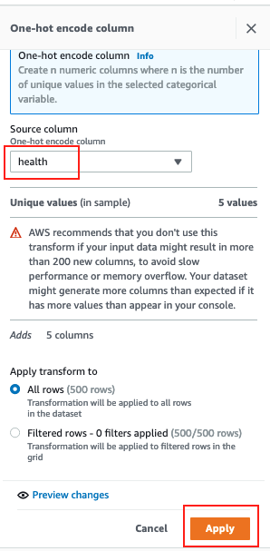

* Click Apply
* This steps splits the health column into a number of columns.
6. A number of  similar changes can be done. e.g. deleting the original gender column and renaming the new gender_mapped column to gender etc.
7. Post all the desired refinements, a recipe containing all the changes to be applied is created. This can be viewed on the right hand pane of the screen.
    
    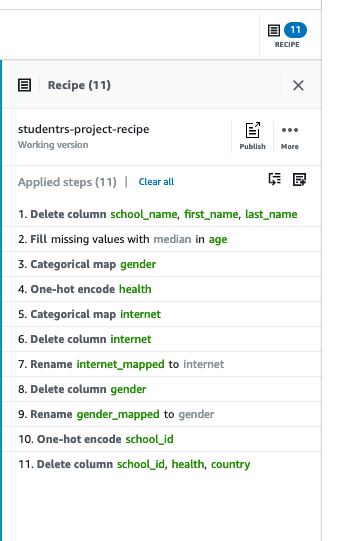

8. The recipe can now be published so that it can be applied to the entire dataset. Select the publish recipe option and leave the version description as is.
    
    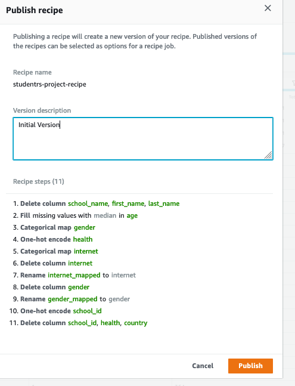

9. The published recipes can be viewed by selecting the Recipe option on the left pane.
    

#### Create Recipe Job on entire dataset
Now that the recipe is created it can be run to profile the entire data student dataset.
1. On the recipe page, choose Create job with this Recipe.
    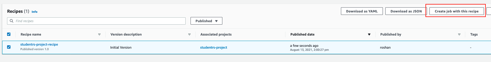

2. For Job name¸ enter ```student-performance```.
3. Leave the job type as Create a recipe job
4. Dataset input as ```studentrs-dataset```.
5. Select the output to Amazon S3 and select the S3 bucket we created in [Step 5](#step-5---create-an-s3-bucket).
    
    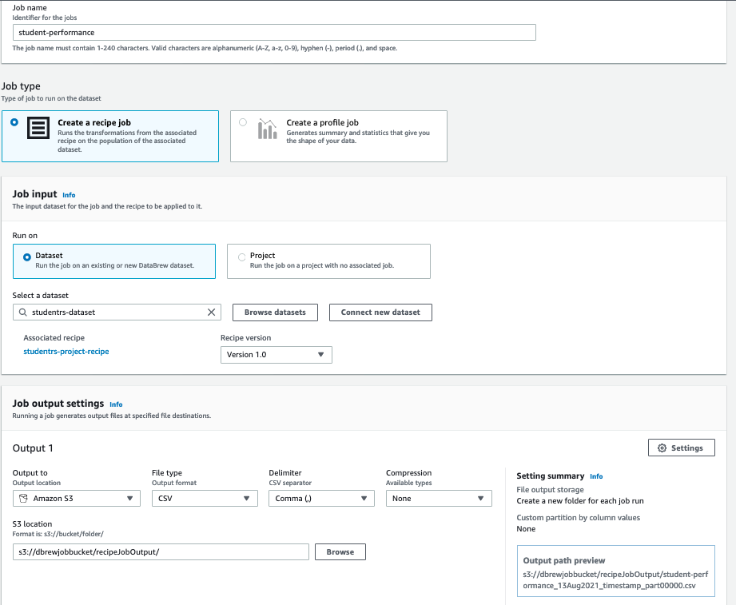

6. For the IAM Role name select ```AwsGlueDataBrewDataAccessRole```
7. Click on Create and run job.
8. Navigate to the Job and wait for the job to finish. This should take a few minutes.
    
    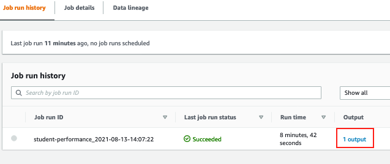

9. Navigate to the output to view the results of the recipe job created in the selected Amazon S3 bucket.
    
    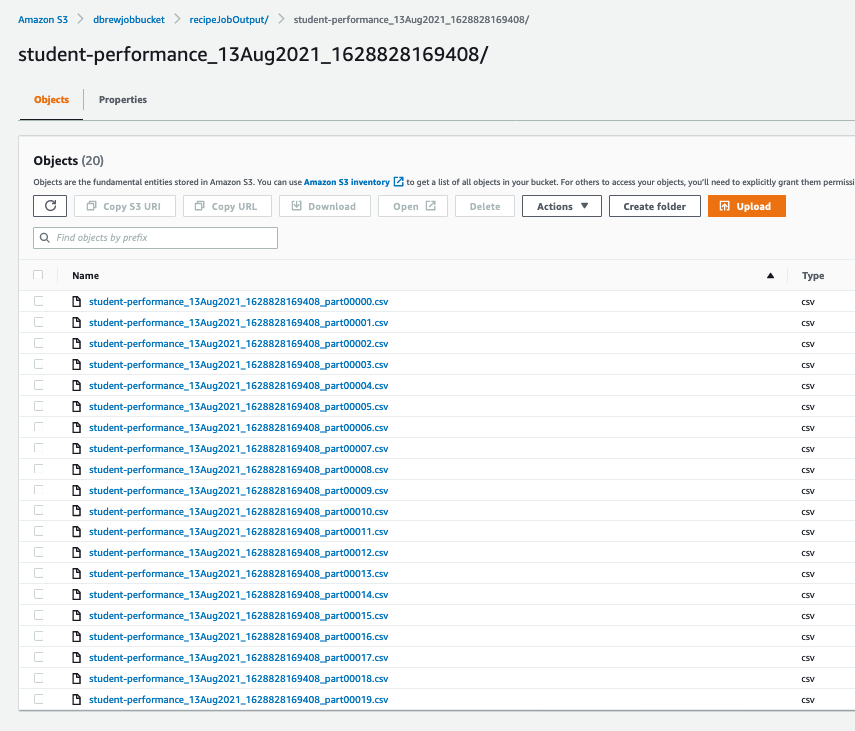

10. This CSV file can now be fed into AL/ML services for further analysis as required.

## Summary
In this lab, we created an Amazon Redshift cluster data warehouse and loaded a student dataset. We used a JDBC connection to create a DataBrew dataset for an Amazon Redshift table. We then performed data profiling followed by some data transformation using DataBrew, preparing the data to be ingested by a ML model building exercise.

## Cleanup
Follow the below steps to cleanup your account to prevent any aditional charges:
* Navigate to the Jobs and delete the recipe job and the profiling job.
    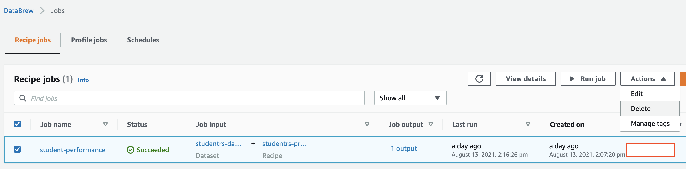

* Navigate to the Recipes and delete the recipe and versions.
    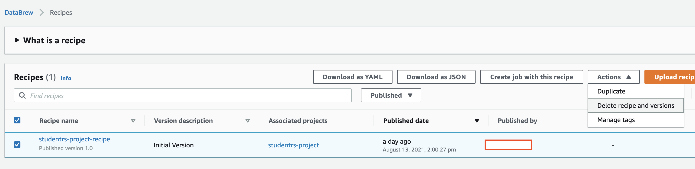

* Navigate to the Projects and delete the project created in the lab.
    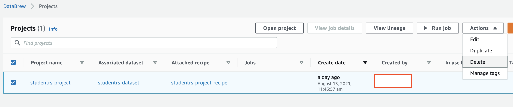

* Navigate to the Datasets and delete the dataset created in the lab.
    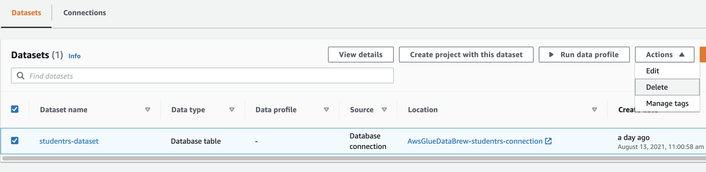
* Navigate to [AWS Glue service](https://ap-southeast-2.console.aws.amazon.com/glue/home?region=ap-southeast-2#) and navigate to connections. 
* Delete connection created in the lab
    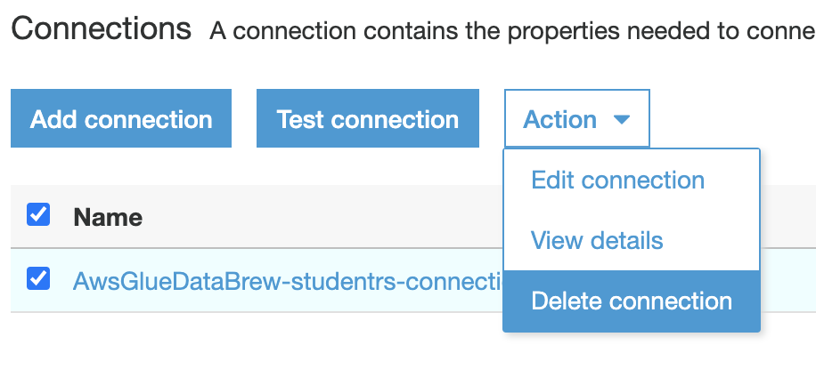

* Navigate to [S3 console](https://s3.console.aws.amazon.com/s3/home?region=ap-southeast-2#)
* Empty and then delete the bucket created in [Step 5](#step-5---create-an-s3-bucket).
* You can choose to remove the VPC Endpoints, IAM Policy and role and any security group alterations done.
* Navigate to [Redshift console](https://ap-southeast-2.console.aws.amazon.com/redshiftv2/home?region=ap-southeast-2#dashboard)
* Open the student-cluster and delete the cluster. Uncheck the prompt to take a snapshot before deletion of the cluster
    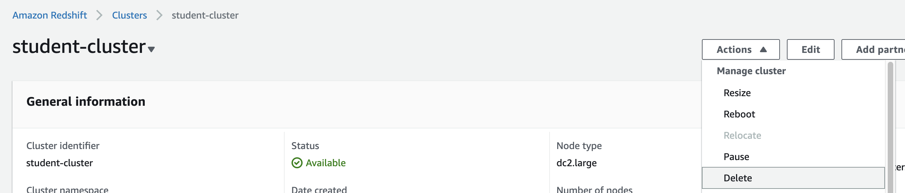
